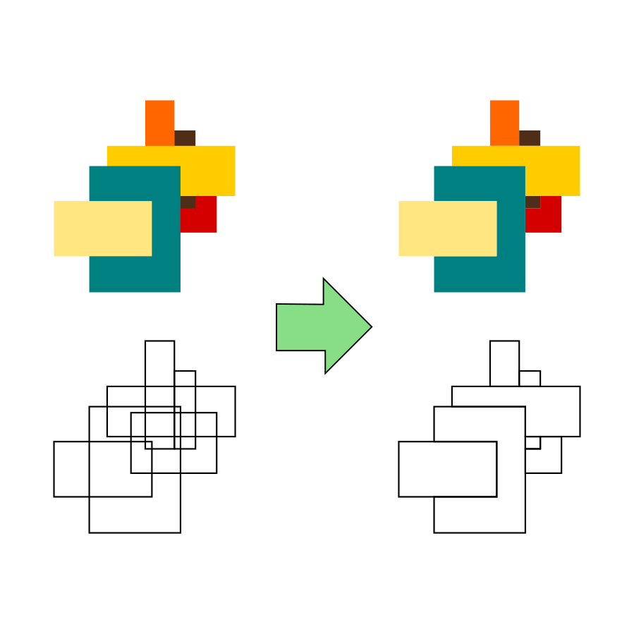

# incadiff

An Inkscape extension which applies successive difference operations on superimposed paths.

Useful for plotter addicts as it removes hidden strokes. 

Hosted at Inkscape.org: https://inkscape.org/~tmaz/%E2%98%85incadiff

